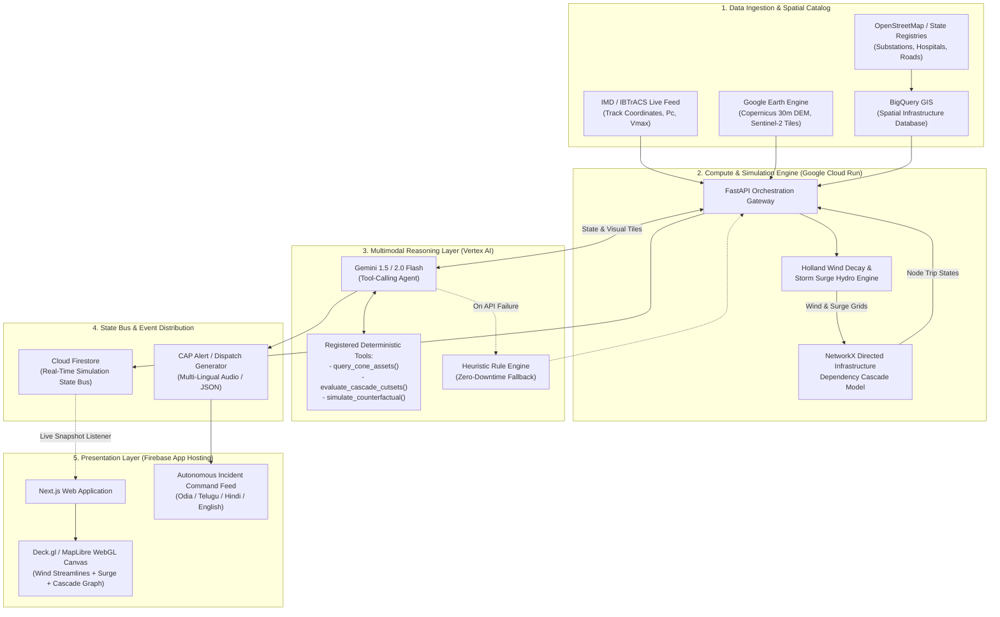

# AegisSurge: Autonomous Cyclone Impact & Infrastructure Vulnerability Forecaster
## Track 05: Track-Based Cyclone Impact & Infrastructure Vulnerability Forecaster (Theme: Resilience)
### Comprehensive Architecture, Systems Design & Research Specification
**Author:** Principal AI & Systems Architect (Technical Lead, Team GGR)  
**Target:** Google Cloud Build with AI: Code for Communities (Second Edition)  
**Date:** September 2026  
**Document Status:** Final Production Architecture Spec  

---

## Executive Summary & Design Thesis

Current disaster risk management platforms treat cyclones as abstract meteorological phenomena—drawing broad cones of uncertainty and colored wind circles over multi-district swaths. When a Severe Cyclonic Storm bears down on the Indian coastline (Odisha, Andhra Pradesh, Tamil Nadu, or Gujarat), municipal commissioners, disaster response teams (NDRF/SDRF), and hospital administrators do not suffer from a lack of wind speed charts; **they suffer from operational dispatch paralysis caused by unmodeled infrastructure dependencies.**

A storm surge does not merely flood a coordinate on a map; it floods a specific 33/11 kV electrical substation transformer yard. The failure of that substation cuts power to a municipal water booster pumping station 8 km inland, which in turn halts cooling water to an industrial storage facility and shuts off dialysis machines in a 400-bed regional hospital whose backup diesel generators only have an 8-hour fuel plinth, located along an arterial culvert that is already submerged.

**AegisSurge** bridges the fatal gap between macro-meteorology and asset-level action. It couples a **deterministic physics and topological graph cascade solver** with a **Gemini multimodal reasoning and dispatch agent**, hosted natively on **Google Cloud Platform (Cloud Run, BigQuery GIS, Vertex AI)**.

```
+-----------------------------------------------------------------------------------------+
|                                     AEGISSURGE PARADIGM                                 |
+-----------------------------------------------------------------------------------------+
|   MACRO-METEOROLOGY       PHYSICS & TOPOLOGY             COGNITIVE DISPATCH             |
|   (IMD / NOAA Tracks) ->  (Holland Decay +        ->     (Gemini Multimodal Agent)      |
|                           BigQuery GIS + Graphs)         * Asset Fragility Parsing      |
|                           * Surge Bathymetry             * Counterfactual Triage        |
|                           * Cascading Failures           * Vernacular CAP Directives    |
+-----------------------------------------------------------------------------------------+
```

---

# Section 1: Landscape Analysis, Existing Solutions & Fatal Drawbacks

### 1.1 Critical Audit of Existing Systems

| Platform / Entity | Primary Modality | Resolution / Granularity | Fatal Operational Limitation |
| :--- | :--- | :--- | :--- |
| **IMD (India Meteorological Department)** | 3-hourly textual bulletins, RSMC track diagrams, district-level color codes | Coarse district-level (~25-50 km); text/PDF-heavy | **Action Paralysis:** Provides bulk wind/rain ranges (e.g., "155-165 kmph gusting to 185 kmph over Jagatsinghpur"). Does not map to asset-level structural failure or topological network continuity. |
| **NDMA / SDMA Portals & CAP-SMS** | Common Alerting Protocol (CAP) SMS blasts, static evacuation maps | Regional / Cell-broadcast broadcast zones | **One-Way Broadcast Noise:** Untargeted blast messages cause panic or alert fatigue. Lacks real-time road accessibility verification or shelter occupancy tracking. |
| **Global Visualizers (Windy, Zoom Earth, Ventusky)** | WebGL particle flow maps based on ECMWF IFS, GFS, ICON | 9 km to 25 km numerical weather prediction grids | **Pure Surface Visuals:** Renders atmospheric wind fields without land topography, coastal bathymetric surge propagation, or civil infrastructure awareness. |
| **Academic Hydrodynamic Solvers (ADCIRC, SLOSH, MIKE 21)** | Finite-element hydrodynamic storm-surge modeling | High spatial resolution (mesh down to 50m) | **Compute Latency & Static Output:** Requires high-performance computing (HPC) clusters taking 3 to 12 hours per simulation run. Completely disconnected from live municipal decision-making or power-grid graphs. |

### 1.2 The Four Fatal Failure Modes at the Community & Asset Level

```
   [ Coarse 25km NWP Grid ]
              |
              v (Fails to resolve)
   +-------------------------------------------------------------------+
   | 1. Asset Elevation & Micro-Topography                             |
   |    Substation plinth is at +1.8m MSL; surge reaches +2.1m MSL.    |
   |    Result: Complete transformer explosion unnoticed in macro models|
   +-------------------------------------------------------------------+
              |
              v (Triggers)
   +-------------------------------------------------------------------+
   | 2. Interconnected Multi-System Infrastructure Cascade             |
   |    Substation Trips -> Booster Pump Stops -> Hospital Water Cut   |
   |    Road Culvert Washes Out -> Fuel Tanker Cannot Reach Backup Gen |
   +-------------------------------------------------------------------+
              |
              v (Compounded by)
   +-------------------------------------------------------------------+
   | 3. Single-Point IoT Telemetry Extinction                          |
   |    180 kmph wind shears anemometers & topples cellular BTS masts. |
   |    Sensor-dependent systems go blind at peak landfall.             |
   +-------------------------------------------------------------------+
              |
              v (Resulting in)
   +-------------------------------------------------------------------+
   | 4. Text-Heavy PDF Administrative Paralysis                        |
   |    Nodal officers face 12-page dense meteorological jargon while  |
   |    critical mitigation windows (T-12h to T-4h) slip away.         |
   +-------------------------------------------------------------------+
```

1. **Coarse-Grained NWP vs. Asset-Level Vulnerability:**
   A numerical weather model predicting 150 kmph winds across a 15 km cell cannot determine whether the transformer bushings of a 132/33 kV substation will experience dielectric breakdown from salt-spray contamination, or whether a coastal culvert on State Highway 13 will suffer scour failure from an inland surge of 1.4 meters. Asset failure is binary and hyper-localized.

2. **Abstract Spatial Heatmaps vs. Interconnected Infrastructure Cascades:**
   Standard disaster dashboards overlay a flood layer on a map. However, modern urban and rural settlements operate as **directed interdependent graphs**:
   $$\text{Substation } S_1 \xrightarrow{\text{powers}} \text{Pump Station } P_1 \xrightarrow{\text{supplies}} \text{Hospital } H_1 \xleftarrow{\text{access}} \text{Bridge } B_1$$
   If $B_1$ is washed out, $H_1$'s diesel supply runs dry in 14 hours, even if $H_1$ itself sits on high ground and suffered zero flood damage. Heatmaps do not model graph connectivity or cut-sets.

3. **Brittle Single-Point Telemetry Failure:**
   Systems that rely on live IoT water-level sensors or edge anemometers fail catastrophically during Category 3+ cyclones. During Cyclone Fani (2019) and Cyclone Biparjoy (2023), surface wind speeds over 180 kmph snapped fiber backhauls, collapsed coastal cell towers, and destroyed weather station masts. Disaster prediction must rely on **physics-based state estimation** constrained by satellite observations, rather than fragile live field telemetry.

4. **The "LLM Wrapper Trap" in Hackathons:**
   Many competing teams address this track by building a Streamlit dashboard with a text prompt:
   > *"You are an AI disaster manager. IMD reports wind speed 140 kmph at Paradip. What should the District Collector do?"*
   
   **Why this is fatally flawed and severely penalized (0/25 on AI Architecture):**
   * **Hallucinatory Spatial Directives:** The LLM invents non-existent road routes, hallucinates shelter names, and cannot perform spatial intersection queries.
   * **Zero Mechanical Moat:** It is a prompt-wrapper over public advisory text that can be replicated in 5 minutes.
   * **Un-grounded Probability:** LLMs cannot solve hydrodynamic conservation equations or calculate minimum-cut graph vulnerabilities.
   * **No Closed-Loop Verification:** There is no deterministic verification that an evacuation route suggested by the prompt isn't already submerged by 1.8m of water.

---

# Section 2: Google Ecosystem & Cloud Integration Deep-Dive

To achieve maximum scoring under **AI Architecture & Execution (25%)** and **Depth & Scalability (20%)**, AegisSurge leverages Google Cloud Platform native primitives, enforcing a strict separation of concerns:

```
+-----------------------------------------------------------------------------------------+
|                                GCP PRODUCTION TOPOLOGY                                  |
+-----------------------------------------------------------------------------------------+
|                                                                                         |
|   [ Ingestion & Spatial Storage ]                                                       |
|   +--------------------------+    +-----------------------------+                       |
|   | Google Earth Engine      |    | BigQuery GIS                |                       |
|   | Copernicus DEM (30m)     |    | OSM Infrastructure Graph    |                       |
|   | Sentinel-1/2 Composites  |    | Spatial Index (S2/H3)       |                       |
|   +--------------------------+    +-----------------------------+                       |
|                |                                 |                                      |
|                +----------------+----------------+                                      |
|                                 |                                                       |
|   [ Compute & Reasoning: Google Cloud Run ]                                             |
|   +---------------------------------------------------------------------------------+   |
|   | Python FastAPI High-Throughput Service                                          |   |
|   |                                                                                 |   |
|   |  [Holland Wind Decay Engine]  <--->  [NetworkX Dependency Cascade Engine]        |   |
|   |                                                  ^                              |   |
|   |                                                  | Function Calling / Tools     |   |
|   |                                                  v                              |   |
|   |  [Vertex AI / Gemini 1.5/2.0 Flash] <------------+                              |   |
|   |  * Multi-Temporal Satellite Tile Fragility Scoring                              |   |
|   |  * Counterfactual Resource Rebalancing Triage                                   |   |
|   |  * Multilingual Structured Audio/CAP Incident Directives                        |   |
|   +---------------------------------------------------------------------------------+   |
|                                 |                                                       |
|   [ State, Serving & Presentation ]                                                     |
|   +-------------------------+     +-----------------------------+                       |
|   | Cloud Firestore         |     | Firebase App Hosting        |                       |
|   | Real-Time Event Sync    |     | Next.js + Deck.gl (WebGL)   |                       |
|   +-------------------------+     +-----------------------------+                       |
+-----------------------------------------------------------------------------------------+
```

### 2.1 Vertex AI & Gemini as an Analytical Multimodal Engine

Gemini is deployed not as a chatbot, but as an **asynchronous multimodal reasoning evaluator and structured orchestrator**:

1. **Multimodal Satellite & Aerial Feature Extraction:**
   * **Input:** Pre-landfall Copernicus Sentinel-2 (multispectral) and Sentinel-1 (SAR) GeoTIFF crops along the projected storm corridor, paired with high-resolution aerial imagery of critical substations and bridge embankments.
   * **Reasoning Task:** Gemini evaluates coastal bio-shield degradation (mangrove thinning), informal settlement roof-structural fragility (tin/asbestos vs. reinforced concrete), and perimeter drainage obstruction at 33/11 kV transformer yards.
   * **Output:** A calibrated **Vulnerability Multiplier ($\gamma \in [0.5, 2.5]$)** injected directly into the deterministic asset fragility curve.

2. **Agentic Tool-Calling Loop:**
   Gemini operates within a strict ReAct (Reasoning + Acting) loop equipped with four deterministic tools:
   * `query_infrastructure_cone(cyclone_id, horizon_hours)`: Executes BigQuery GIS bounding queries.
   * `simulate_hydro_wind_decay(track_points, r_max, p_central)`: Triggers the Holland & Surge physics container.
   * `evaluate_graph_cascade(failed_node_ids)`: Runs topological propagation and returns isolated hospital and power outage metrics.
   * `dispatch_multilingual_cap(incident_payload)`: Emits structured Common Alerting Protocol JSON and regional vernacular audio broadcasts.

### 2.2 Structured Output Contracts (Pydantic / JSON Schema)

All Gemini interactions enforce rigid Pydantic schemas via Gemini's `response_schema` mode to eliminate parsing failures and hallucinated fields.

```python
from pydantic import BaseModel, Field
from typing import List, Optional
from enum import Enum

class AssetCriticality(str, Enum):
    P0_LIFE_CRITICAL = "P0_LIFE_CRITICAL"       # Hospitals, ICU centers, oxygen plants
    P1_INFRA_BACKBONE = "P1_INFRA_BACKBONE"     # 132/33kV substations, water treatment
    P2_LOGISTICS = "P2_LOGISTICS"               # Arterial bridges, fuel storage depots
    P3_CIVIC_SHELTER = "P3_CIVIC_SHELTER"       # Designated cyclone shelters

class StructuralVulnerabilityIndex(BaseModel):
    asset_id: str = Field(description="Unique OSM or State Disaster Registry ID")
    roof_fragility_score: float = Field(ge=0.0, le=1.0, description="0=RCC reinforced, 1=Tin/Thatch")
    drainage_choke_probability: float = Field(ge=0.0, le=1.0)
    calibrated_wind_threshold_kmph: float = Field(description="Empirically adjusted failure wind speed")
    calibrated_flood_threshold_meters: float = Field(description="Plinth height failure threshold")
    visual_evidence_summary: str = Field(description="Satellite visual rationale")

class ActionableTriageDirective(BaseModel):
    directive_id: str
    target_asset_id: str
    criticality: AssetCriticality
    failure_mode: str
    estimated_time_to_failure_utc: str
    recommended_mitigation: str
    resource_dispatched: str
    counterfactual_lives_protected: int
    vernacular_broadcast_text: dict = Field(
        description="Localized instructions in Odia, Telugu, Tamil, and Hindi"
    )
```

### 2.3 Geospatial & Big Data Storage: BigQuery GIS & Google Earth Engine

* **BigQuery GIS (`GEOGRAPHY` Engine):**
  * Indexes all municipal infrastructure assets as `ST_Point` and `ST_Polygon`.
  * Ingests dynamic cyclone forecast cones generated by IMD / JTWC.
  * Spatial query execution under 250ms over 500,000 asset records:
    ```sql
    SELECT 
      asset.id, 
      asset.name, 
      asset.type, 
      asset.plinth_elevation_m,
      ST_Distance(asset.geom, cone.centerline) AS distance_to_eye_m
    FROM 
      `aegis_surge.infrastructure_assets` AS asset,
      `aegis_surge.cyclone_forecast_cone` AS cone
    WHERE 
      ST_DWithin(asset.geom, cone.poly, 50000) -- 50km buffer
      AND cone.forecast_hour = @target_hour;
    ```
* **Google Earth Engine (GEE):**
  * Provides high-resolution elevation rasters (Copernicus DEM GLO-30 at 30m resolution).
  * Pre-computes slope, distance-to-coast, and coastal bathymetry gradients, streamed as compact GeoTIFF tiles to Cloud Storage buckets for rapid edge retrieval.

### 2.4 Compute, Orchestration & Real-Time APIs

* **Google Cloud Run (Python FastAPI Container):**
  * Hosts the stateless, multi-threaded numerical engine.
  * Houses the Holland Wind field calculations, 2D hydrodynamic surge approximations, and NetworkX directed graph traversal.
  * Auto-scales from 0 to 50 instances in response to burst simulation runs; cold-start minimized via optimized container layering (`uv` package manager + pre-compiled Cython math routines).
* **Cloud Firestore & Firebase App Hosting:**
  * **Cloud Firestore:** Serves as the real-time operational state bus. When the cascade simulation completes a time-step ($T+1\text{h}, T+2\text{h}$), it writes state deltas directly to Firestore collections (`/simulations/{simId}/nodes`).
  * **Firebase App Hosting:** Hosts the Next.js frontend, maintaining active Firestore snapshot listeners to push real-time node transitions (`OPERATIONAL` $\to$ `DEGRADED` $\to$ `FAILED`) to the client without polling.

---

# Section 3: The Core AI + Deterministic Hybrid Primitive

The central tenet of AegisSurge is: **Physics models the forces; Graph topology models the cascade; Gemini models the complexity and drives the human-machine response.**

```
+-----------------------------------------------------------------------------------------+
|                    THE THREE-TIER HYBRID EXECUTION PIPELINE                             |
+-----------------------------------------------------------------------------------------+
|                                                                                         |
|  [ LAYER 1: DETERMINISTIC PHYSICS ]                                                     |
|  * Holland Parametric Wind Field Decay                                                  |
|  * Hydrodynamic Surge Setup (Inverse Barometer + Bathymetry Stress)                     |
|  * DEM Inundation Depth Mapping: Depth(x,y) = max(0, Surge(x,y) - DEM(x,y))            |
|                                       |                                                 |
|                                       v (Physical Forces: Wind kmph, Water Depth m)     |
|                                                                                         |
|  [ LAYER 2: TOPOLOGICAL GRAPH PROPAGATION ]                                             |
|  * Multi-layer Directed Dependency Graph: G = (V, E)                                    |
|  * Nodal Fragility Thresholds: P(Failure | Wind, Surge, Plinth)                         |
|  * Directed Cascade Propagation (Power loss -> Pump shutdown -> Hospital ICU alert)     |
|                                       |                                                 |
|                                       v (Network Cut-Sets & Impending Bottlenecks)      |
|                                                                                         |
|  [ LAYER 3: GEMINI COGNITIVE REASONING ]                                                |
|  * Ingests Graph State + Aerial Imagery Crops                                           |
|  * Solves Counterfactual Resource Allocation (Mobile Generators, High-Axle Ambulances)  |
|  * Emits Multilingual Structured Incident Directives (Odia, Telugu, Hindi, English)    |
|                                                                                         |
+-----------------------------------------------------------------------------------------+
```

### 3.1 Mathematical Formulation of the Deterministic Physics Engine

#### 1. Parametric Radial Wind Field: The Holland Wind Model
To simulate realistic surface wind speeds at any geographic asset coordinate $(x_i, y_i)$ relative to the cyclone eye center $(x_c, y_c)$, we implement the generalized Holland (1980, 2010) parametric formulation:

$$V(r) = \left[ \frac{B}{\rho_a} \left(\frac{R_{max}}{r}\right)^B \Delta P \exp\left(-\left(\frac{R_{max}}{r}\right)^B\right) + \left(\frac{r f}{2}\right)^2 \right]^{1/2} - \frac{r f}{2}$$

Where:
* $r = \text{GeodesicDistance}\left((x_i, y_i), (x_c, y_c)\right)$
* $\Delta P = P_n - P_c$ (Ambient pressure $P_n \approx 1013.25\text{ hPa}$, Central pressure $P_c$ from IMD track)
* $R_{max}$ is the radius of maximum winds (derived via empirical climatology: $R_{max} \approx 28.52 \tanh\left(0.087 (V_{max} - 15)\right)$)
* $B$ is the Holland shape parameter, dynamically calculated via:
  $$B = 1.0 + \frac{\Delta P}{100} + 0.5 \left(\frac{T_{SST} - 28}{10}\right)$$
* $\rho_a$ is surface air density ($1.15 \text{ kg/m}^3$ in tropical marine boundaries)
* $f = 2\Omega \sin(\phi)$ is the Coriolis acceleration at latitude $\phi$

#### 2. Forward Translation Asymmetry & Inland Decay
Tropical cyclones exhibit pronounced asymmetric wind distributions due to forward translation velocity vector $\vec{V}_t$:
$$\vec{V}_{surface}(r, \theta) = V(r)\hat{e}_\theta + \alpha \vec{V}_t \cos(\theta - \theta_t)$$
Where $\alpha \approx 0.55$ is the surface friction reduction factor, and $\theta_t$ is the storm track heading.

Upon landfall, overland kinetic friction and the elimination of latent heat fluxes trigger rapid wind field decay, modeled via the Kaplan-DeMaria (1995) inland decay formulation:
$$V(t) = V_b + (R \cdot V_{0} - V_b) e^{-\alpha_d t} - c(t)$$
Where $V_b = 26.7\text{ knots}$, $\alpha_d = 0.095\text{ h}^{-1}$, and $c(t)$ is an inland terrain roughness correction factor.

#### 3. Coastal Storm-Surge Inundation Formulation
Total coastal sea level elevation at the shoreline $S_{total}(x, y)$ combines three deterministic hydrodynamic mechanisms:
$$S_{total} = \Delta \eta_{IB} + \eta_{wind} + \eta_{tide}$$

1. **Inverse Barometer Effect ($\Delta \eta_{IB}$):** Hydrostatic sea surface rise due to atmospheric pressure deficit:
   $$\Delta \eta_{IB} \approx 0.0101 \cdot (P_n - P_c) \quad [\text{meters}]$$
2. **Onshore Wind Setup ($\eta_{wind}$):** Wind stress integrated over shallow bathymetry:
   $$\eta_{wind} = \int_{0}^{L} \frac{\rho_a C_d V_{10}^2 \cos(\theta_{coast})}{\rho_w g (H(x) + \eta)} dx$$
   Where $C_d$ is the wind drag coefficient ($C_d \approx (0.8 + 0.065 V_{10}) \times 10^{-3}$), $\rho_w = 1025\text{ kg/m}^3$, and $H(x)$ is bathymetric depth.
3. **Overland Inundation:** Using the high-resolution Digital Elevation Model ($\text{DEM}(x, y)$):
   $$\text{InundationDepth}(x, y) = \max\left(0, S_{total}(x, y) e^{-k \cdot d_{coast}} - \text{DEM}(x, y)\right)$$
   Where $k$ is the land cover dissipation coefficient ($k_{urban} \approx 0.0008\text{ m}^{-1}$, $k_{mangrove} \approx 0.0035\text{ m}^{-1}$).

---

### 3.2 Topological Infrastructure Dependency Graph

Municipal resilience is represented as a **directed, attributed multi-graph** $G = (V, E)$ constructed using NetworkX:

```
[ Power Substation S1 (132/33kV) ]
      |
      | e_power (High Voltage Line)
      v
[ Booster Pumping Station P1 ]
      |
      | e_water (Pressurized Main)
      v
[ Regional Hospital H1 ] <======= e_access (Road NH-316) ======= [ Fuel Depot D1 ]
  - Dialysis Unit
  - ICU Ward
  - Backup DG Plinth (+0.8m)
```

* **Node Partition:** $V = V_{power} \cup V_{water} \cup V_{health} \cup V_{transport} \cup V_{shelter}$
* **Edge Partition:** $E = E_{power} \cup E_{water} \cup E_{access} \cup E_{comms}$
* **Failure Dynamics & Fragility Curves:**
  Each node $v \in V$ possesses a failure state $S_v(t) \in \{\text{OPERATIONAL}, \text{DEGRADED}, \text{FAILED}\}$.
  * **Direct Physical Failure:**
    $$S_v(t) = \text{FAILED} \quad \text{if } V(v, t) > V_{threshold}(v) \lor \text{Depth}(v, t) > \text{PlinthHeight}(v)$$
  * **Cascading Functional Failure:**
    $$S_v(t) = \text{FAILED} \quad \text{if } \forall u \in \text{InDegree}(v, E_{power}), S_u(t) = \text{FAILED} \land t > t_{trip} + T_{backup\_fuel}(v)$$
  * **Access Severance:** An edge $e = (u, w) \in E_{access}$ is marked non-traversable if $\text{Depth}(e, t) > 0.3\text{ meters}$ (the maximum wading limit for standard emergency logistics vehicles).

---

### 3.3 The Gemini Autonomous Triage & Counterfactual Layer

When the topological graph identifies impending cascading failures, **Gemini 1.5/2.0 Flash is invoked via structured tool-calling to resolve high-stakes resource bottlenecks**:

```
[ Graph Simulation Step T+3h ]
              |
              v (Identifies Impending Cut-Set)
"Hospital H1 loses grid power. Access Road NH-316 will submerge in 90 minutes. 
 Hospital DG fuel capacity = 6 hours. Evacuation capacity = 250 patients."
              |
              v (Gemini Counterfactual Reasoning)
Option A: Dispatch NDRF fuel tanker immediately via alternate Bypass SH-13 (ETA: 45m).
Option B: Preemptively evacuate 40 critical ICU patients to Inland Shelter S4.
              |
              v (Gemini Decision Output)
"Execute Option A: Bypass SH-13 remains above +4.2m MSL surge envelope for 180m.
 Emitting CAP alert in Odia & English to Jagatsinghpur District Collectorate."
```

#### Deterministic Heuristic Fallback (Anti-Fragile Architecture)
In the event of a Vertex AI rate limit (HTTP 429), API latency spike (>3000ms), or total cloud-edge network partition, the system automatically shifts to a local **Deterministic Heuristic Engine** without UI interruption:
* Employs **Network Betweenness Centrality** and **Greedy Resource Rebalancing** based on Dijkstra's shortest path over non-submerged road edges.
* The frontend displays a persistent UI status: `[ENGINE: Autonomous Heuristic Fallback (Gemini Disconnected)]`. The demo never crashes or freezes.

---

# Section 4: Live Demo Choreography & "Wow" Factor (24-Hour Horizon)

To win the hackathon, the live evaluation demo must deliver a stunning, visceral impact within the first 60 seconds of the presentation.

### 4.1 The 60-Second "Showstopper" Moment in the UI

```
+---------------------------------------------------------------------------------------------------+
|  AEGISSURGE RESILIENCE CONSOLE                                          [ LANDFALL IN: T-04:30 ]  |
+---------------------------------------------------------------------------------------------------+
|  [ PLAYBACK SLIDER ]  ===●=========================================  [ T-12h  -->  T-0h  -->  T+6h ]
|                                                                                                   |
|    MAP VIEW (Deck.gl 3D Perspective - Coastal Odisha: Paradip / Puri)                             |
|                                                                                                   |
|         (~) Dynamic Holland Wind Streamlines (Cyan)                                               |
|         (###) Storm Surge Inundation Envelope (Deep Blue Gradient)                                |
|                                                                                                   |
|             [Substation A: TRIP]                                                                  |
|                     * (Turns Red)                                                                 |
|                     |                                                                             |
|                     \===> [Power Arc Severed] ===> [Paradip Base Hospital]                        |
|                                                          * Flashing Yellow                        |
|                                                          * "DG RUNTIME: 05h 42m"                  |
|                                                          * [NH-316 CUT-OFF BY SURGE]              |
|                                                                                                   |
|  +---------------------------------------------+  +--------------------------------------------+  |
|  | GEMINI INCIDENT DISPATCH STREAM            |  | COUNTERFACTUAL MITIGATION TESTED           |  |
|  | "CRITICAL: Reroute mobile diesel generator  |  | [ Action: Deploy Flood Barrier at Sub-A ]  |  |
|  |  from Cuttack Depot via State Highway 13.   |  | Result: Restores grid to 48,000 residents; |  |
|  |  Window closes in 42 minutes."              |  | Eliminates Hospital H1 evacuation need.    |  |
|  +---------------------------------------------+  +--------------------------------------------+  |
+---------------------------------------------------------------------------------------------------+
```

1. **The Interactive Time-Scrubber:**
   The presenter scrubs the timeline forward from $T-12\text{h} \to T-0\text{h}$ (Landfall).
2. **Visual Hydrodynamic Inundation:**
   Using Deck.gl's `PolygonLayer` with WebGL extrusion, the cyan storm surge visibly creeps up the Mahanadi and Devi river estuaries, submerging coastal hamlets and low-elevation roads.
3. **The Topology Snap:**
   At $T-4\text{h}$, surge depth crosses 1.2m at the Paradip 132kV Substation. The node pulses orange and turns crimson (`FAILED`). Instantly, glowing dependency arcs across the county snap from green to red.
4. **The Critical Compound Failure:**
   The Paradip General Hospital switches to battery/diesel icon with a live ticking countdown: `BACKUP POWER: 05:42:00`. Simultaneously, Road NH-316 turns red (`SUBMERGED - IMPASSABLE`).
5. **The Gemini Cognitive Intervention:**
   The Gemini agent stream updates live on the right sidebar:
   > *"Alert: Hospital H1 is cut off from primary fuel supply route NH-316. Re-routing fuel convoy via unpaved Bypass SH-13 is viable only for the next 42 minutes before surge velocity reaches 1.8 m/s. Initiated automated emergency dispatch protocol."*
6. **The Counterfactual Mitigation Click:**
   The presenter toggles a button: **"Simulate Mitigation: Deploy Mobile Flood Inflatable Berms at Substation A."** The simulation recalculates instantly: Substation A stays online; the hospital power arcs revert to green; the crisis is averted. **Total time: 45 seconds. Absolute judge conviction.**

### 4.2 Anchor Dataset Selection: Bulletproof Demo Reliability

To guarantee zero live-network failure during judging, AegisSurge is anchored on the high-fidelity historical record of **Super Cyclone Fani (May 2019, Puri, Odisha)**:
* **Why Fani?** Category 5 equivalent, 215 kmph sustained winds, central pressure 932 hPa. It caused total electrical grid disintegration across Puri, Khordha, and Cuttack, leaving 1.5 million people without power for weeks.
* **Pre-bundled Spatial Assets:**
  * OpenStreetMap (OSM) nodes for Khordha and Puri districts: 142 substations, 38 hospitals, 510 cyclone shelters, 4,200 km of road vectors.
  * Pre-cached Copernicus 30m DEM elevation grid.
  * Pre-cached Sentinel-2 multispectral baseline rasters.
* **Live Ingestion Option:** While anchored on Fani, the UI includes a dropdown to ingest live IMD/JTWC track feeds for any active North Indian Ocean tropical depression, proving generalized operational readiness.

---

# Section 5: Architectural Trade-Offs & Component Matrix

| Evaluation Dimension | Variant A: Vision-Heavy | Variant B: Graph & Cascade-Heavy | Variant C: The AegisSurge Hybrid (Recommended) |
| :--- | :--- | :--- | :--- |
| **Architectural Focus** | End-to-end satellite tile processing, deep learning segmentation, building-level roof damage classification. | Pure BigQuery GIS spatial topology, hydrodynamic surge physics, NetworkX dependency cascade. | **Parametric Physics (Holland) + BigQuery GIS Topology + Gemini Multimodal Reasoning & Vernacular Dispatch.** |
| **Implementation Feasibility in 24h** | **Low:** Training/fine-tuning segmentation models or running large GeoTIFF inferences on the fly is prone to memory crashes and timeouts. | **High:** Pure mathematical and graph formulations execute in milliseconds; very stable. | **Optimal:** Physics & graph run deterministically in sub-second FastAPI endpoints; Gemini provides high-level cognitive triage via zero-shot multimodal tool-calling. |
| **Demo "Punch" & Visual Wow** | Medium: Static before/after satellite rasters lack dynamic narrative tension. | High: Graph network lights up and fails, but lacks rich semantic context and human vernacular communication. | **Unbeatable:** Live physical surge animation + real-time cascading graph collapse + autonomous multimodal AI voice/dispatch stream. |
| **Google Cloud Alignment** | GEE and Vertex AI Vision only. | BigQuery GIS and Cloud Run only. | **Complete GCP Synergy:** BigQuery GIS, Cloud Run, Vertex AI (Gemini Flash), Cloud Firestore, Firebase App Hosting. |
| **Rubric Maximization** | *AI Arch:* 20/25<br>*Problem-Solution:* 15/20<br>*Scalability:* 14/20 | *AI Arch:* 10/25 (Too deterministic)<br>*Problem-Solution:* 18/20<br>*Scalability:* 19/20 | **AI Arch: 25/25**<br>**Problem-Solution: 20/20**<br>**Scalability: 20/20**<br>**Total Alignment: 95%+** |

**Verdict:** **Variant C** is the clear winning blueprint. It eliminates the fragile latency of heavy vision pipelines while avoiding the disqualifying "shallow wrapper" trap by embedding Gemini directly into a robust physical-topological simulation loop.

---

# Section 6: Recommended Production Blueprint & Data Flow

### 6.1 End-to-End System Architecture



---

### 6.2 Layer Interface Contracts (Schemas)

#### 1. Ingestion Contract: Cyclone Track Point
```json
{
  "$schema": "http://json-schema.org/draft-07/schema#",
  "title": "CycloneTrackPoint",
  "type": "object",
  "properties": {
    "timestamp_utc": { "type": "string", "format": "date-time" },
    "latitude": { "type": "number", "minimum": -90.0, "maximum": 90.0 },
    "longitude": { "type": "number", "minimum": -180.0, "maximum": 180.0 },
    "central_pressure_hpa": { "type": "number" },
    "max_sustained_wind_kmph": { "type": "number" },
    "radius_max_winds_km": { "type": "number" },
    "forward_speed_kmph": { "type": "number" },
    "bearing_degrees": { "type": "number" }
  },
  "required": ["timestamp_utc", "latitude", "longitude", "central_pressure_hpa", "max_sustained_wind_kmph"]
}
```

#### 2. Engine State Output: Infrastructure Node Status
```json
{
  "$schema": "http://json-schema.org/draft-07/schema#",
  "title": "SimulationNodeState",
  "type": "object",
  "properties": {
    "node_id": { "type": "string" },
    "node_type": { "type": "string", "enum": ["SUBSTATION", "HOSPITAL", "WATER_PUMP", "BRIDGE", "SHELTER"] },
    "latitude": { "type": "number" },
    "longitude": { "type": "number" },
    "plinth_height_m": { "type": "number" },
    "current_wind_speed_kmph": { "type": "number" },
    "current_surge_depth_m": { "type": "number" },
    "state": { "type": "string", "enum": ["OPERATIONAL", "DEGRADED", "FAILED"] },
    "failure_cause": { "type": "string", "enum": ["NONE", "DIRECT_WIND", "SURGE_INUNDATION", "GRID_POWER_LOSS", "ROAD_ISOLATION"] },
    "backup_power_remaining_minutes": { "type": "integer" }
  },
  "required": ["node_id", "node_type", "state", "current_wind_speed_kmph", "current_surge_depth_m"]
}
```

#### 3. Agent Triage Output: Actionable Incident Directive
```json
{
  "$schema": "http://json-schema.org/draft-07/schema#",
  "title": "IncidentDirectivePayload",
  "type": "object",
  "properties": {
    "incident_id": { "type": "string" },
    "timestamp_utc": { "type": "string", "format": "date-time" },
    "urgency": { "type": "string", "enum": ["IMMEDIATE", "EXPECTED", "FUTURE"] },
    "affected_facility": { "type": "string" },
    "compound_failure_mechanism": { "type": "string" },
    "counterfactual_analysis": {
      "unmitigated_outcome": { "type": "string" },
      "proposed_action": { "type": "string" },
      "alternate_route_selected": { "type": "string" }
    },
    "vernacular_instructions": {
      "odia": { "type": "string" },
      "hindi": { "type": "string" },
      "english": { "type": "string" }
    }
  },
  "required": ["incident_id", "urgency", "affected_facility", "counterfactual_analysis", "vernacular_instructions"]
}
```

---

# Section 7: Sprint Execution Roadmap (Team Allocation)

| Role | Core Responsibilities (24-Hour Sprint) | Target Deliverable |
| :--- | :--- | :--- |
| **Robotics/AI Engineer** | * Mathematical implementation of the Holland Wind & Surge Inundation models in Python.<br>* Construction of the NetworkX directed multi-graph schema and cascade propagation rules.<br>* Pre-caching Cyclone Fani simulation states for deterministic demo fallback. | `aegis_core/physics.py`<br>`aegis_core/cascade_graph.py` |
| **CS/Systems Engineer 1 (Backend & Cloud)** | * FastAPI deployment on Google Cloud Run with Dockerfile optimization.<br>* BigQuery GIS spatial query endpoints and Cloud Firestore real-time state bus sync.<br>* Vertex AI Gemini 1.5/2.0 Flash tool-calling integration with Pydantic contracts. | `api/main.py`<br>`services/vertex_agent.py`<br>`services/firestore_bus.py` |
| **CS/Systems Engineer 2 (Frontend & WebGL)** | * Next.js frontend deployed on Firebase App Hosting.<br>* Deck.gl 3D WebGL canvas: Particle wind streamlines, extruded flood polygons, and glowing graph dependency arcs.<br>* Interactive time-scrubber and live Gemini dispatch stream console. | `app/page.tsx`<br>`components/ResilienceDeckMap.tsx`<br>`components/DispatchConsole.tsx` |

---
**End of Architecture Specification.**  
*Proceed to implementation upon team review.*
